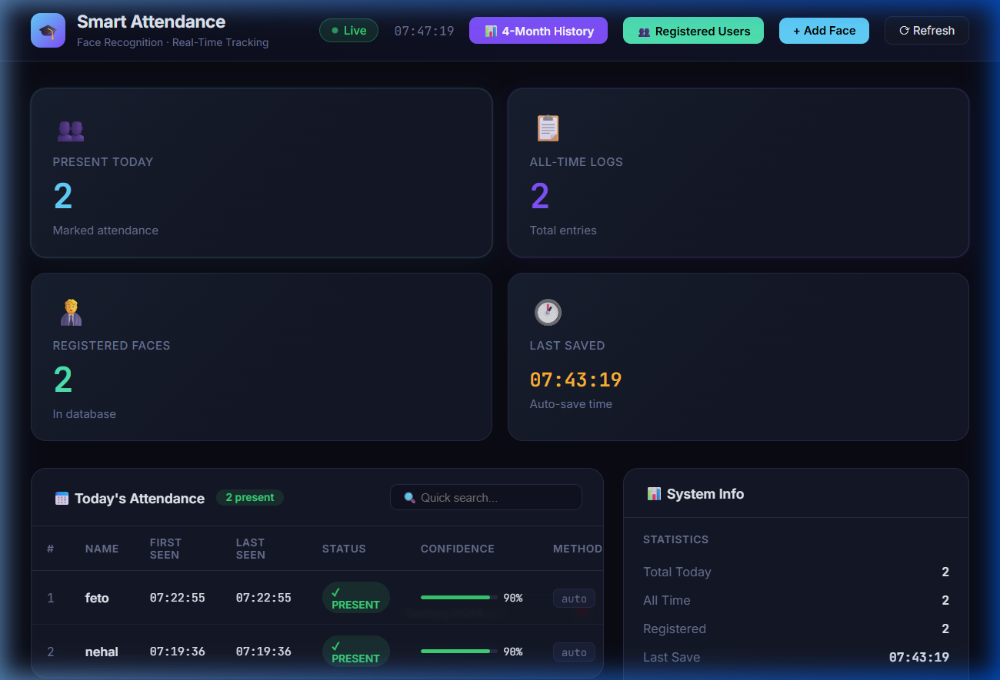

# 🎓 Smart Attendance System (Face Recognition)

A high-performance, minimalist, and smart attendance tracking system using Computer Vision and Deep Learning. This system identifies registered users, tracks them in real-time, and provides a powerful web-based dashboard for management and reporting.

---

## 🖼️ Visual Previews

### 📊 Web Dashboard


### 📈 Attendance History & User Management
<div align="center">
  
  
</div>

---

## ✨ Key Features

### 📸 Smart Camera System
- **High-Definition (HD):** Configured for 1280x720 (720p) resolution for crystal clear identification.
- **Fast Startup:** Uses DirectShow (Windows optimized) for near-instant camera initialization.
- **Minimalist UI:** Clean, non-distracting overlay showing only the face bounding box and identified name.
- **Real-time Tracking:** Intelligent user tracking to avoid duplicate attendance entries in the same session.

### 📊 Web Dashboard (Flask)
- **Real-time Monitoring:** View today's attendance as it happens.
- **User Management:** Add new faces directly via your webcam or delete existing users with one click.
- **4-Month History:** Generate aggregated reports showing how many days each person has attended over the last 120 days.
- **Advanced Search:** Search for specific names in both daily logs and historical records.
- **Automatic Reset:** Daily logs clear automatically every 24 hours to keep your focus on today's data.

### ⚡ One-Click Operation
- **`OPEN_CAMERA.bat`**: Launch the main scanning system immediately.
- **`OPEN_DASHBOARD.bat`**: Open the web control panel in your browser instantly.

---

## 🛠️ Installation & Setup

1. **Clone the Project:**
   ```bash
   git clone https://github.com/YOUR_USERNAME/smart_attendance_system.git
   cd smart_attendance_system
   ```

2. **Install Dependencies:**
   Ensure you have Python 3.8+ installed. Then run:
   ```bash
   pip install opencv-python numpy dlib face_recognition flask pandas openpyxl
   ```
   *(Note: Installing `dlib` on Windows may require Visual Studio C++ Build Tools.)*

---

## 🚀 How to Use

### 1. Registering Users
- Open the **Dashboard** (`OPEN_DASHBOARD.bat`).
- Click on **"+ Add Face"**.
- Enter the person's name and look at the camera.
- Click **"Capture & Save"**.

### 2. Marking Attendance
- Launch the **Camera** (`OPEN_CAMERA.bat`).
- The system will automatically detect and recognize faces.
- Once a face is recognized, attendance is logged for the day.
- Alternatively, use the **"Mark Attendance"** button in the Dashboard for manual web-scanning.

### 3. Reviewing Reports
- Click **"📊 4-Month History"** in the dashboard to see long-term attendance trends.
- Search for any name using the search bars to filter records instantly.

---

## 📁 Project Structure
- `main.py`: Core application entry point.
- `dashboard.py`: Flask-based web server and UI.
- `recognizer.py`: Face encoding and recognition logic.
- `database_manager.py`: Record keeping (Daily CSV & Master Log).
- `config.py`: System settings (Resolution, FPS, Thresholds).
- `reports/`: Stores all CSV and Excel attendance files.
- `database/faces/`: Stores captured face images.

---

## 🔒 Security & Privacy
- **Master Log:** All attendance data is stored locally in `reports/master_attendance_log.csv`.
- **Local Processing:** No face data is sent to the cloud; everything is processed locally on your machine.

---

## 🤝 Contributing
Feel free to fork this project and submit pull requests for any improvements or new features!

---
*Powered by Python, OpenCV, and Gemini AI Technology.*
